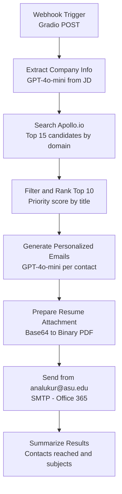

# 🎯 Job Application Outreach Agent

> 🔗 **[Live n8n Workflow](https://aravind5.app.n8n.cloud/workflow/O6EBcekwsGCqY2z7)**

A personal job search automation agent with just two inputs: paste a job description and upload a resume. GPT-4o-mini auto-extracts the company, role, and domain; Apollo.io finds the top 10 hiring contacts; GPT personalizes your outreach email template for each contact; and emails fire from analukur@asu.edu via SMTP with the resume attached — zero manual field entry.

## What It Does

Paste a JD and upload your resume. The agent automatically:

1. **Auto-extracts from the JD** — GPT-4o-mini parses company name, domain (e.g. `stripe.com`), job title, and team name without any manual input
2. **Searches Apollo.io** — queries 275M+ contacts for hiring managers, recruiters, VP/Head of Engineering, engineering managers, and tech leads at the company
3. **Filters and ranks top 10** — scores contacts by title priority and filters to verified emails only
4. **Personalizes each email** — GPT-4o-mini writes a unique subject line and 2-3 sentence opening per contact, referencing their specific role; the core template remains fixed
5. **Attaches the resume** — PDF is encoded and attached to every outbound email
6. **Sends from analukur@asu.edu** — outreach fires via SMTP through ASU's Office 365 server, not Gmail
7. **Returns a contact summary** — names, titles, emails, and subject lines for every message sent

## n8n Workflow Architecture



## Setup Instructions

### 1. Clone or fork this Space

```bash
git clone https://huggingface.co/spaces/Darkweb007/job-outreach-agent
cd job-outreach-agent
```

### 2. Install dependencies

```bash
pip install -r requirements.txt
```

### 3. Configure HF Secrets

In your Hugging Face Space settings, add the following secrets:

| Secret Name | Description | Required |
|---|---|---|
| `OPENAI_API_KEY` | OpenAI API key for GPT-4o-mini (extract + personalize) | Yes |
| `APOLLO_API_KEY` | Apollo.io API key for contact search | Yes |

Navigate to: **Space Settings → Variables and Secrets → New Secret**

### 4. Configure SMTP Credential in n8n

The workflow sends from `analukur@asu.edu` using ASU's Office 365 SMTP server. Set this up once in n8n:

1. Go to **n8n → Credentials → New Credential → SMTP**
2. Enter these settings:

| Field | Value |
|---|---|
| Host | `smtp.office365.com` |
| Port | `587` |
| Security | STARTTLS |
| Username | `analukur@asu.edu` |
| Password | Your ASU password (or app password if MFA is enabled) |

3. Name the credential **`ASU SMTP`** — this matches what the workflow expects
4. Save and connect it to the **Send from analukur@asu.edu** node

> **Note:** If ASU requires an app password for SMTP, generate one at [myaccount.microsoft.com](https://myaccount.microsoft.com) under Security → App passwords.

### 5. Activate the workflow

In n8n, open the workflow and click **Activate** (top-right toggle). The webhook URL becomes live at:
```
https://aravind5.app.n8n.cloud/webhook/job-outreach-v2
```

### 6. Run locally

```bash
python app.py
```

### 7. Deploy to HF Spaces

Push to your Space repository — it builds and deploys automatically.

## How to Use

1. Paste the full job description into the text area
2. Upload your resume PDF
3. API keys are pre-filled from HF Secrets — no manual entry needed
4. Click **Find Contacts & Send Outreach Emails**
5. Wait 1-3 minutes while the agent runs end-to-end
6. A card appears listing every contact reached, their title, email, and subject line

## Supported Integrations

| System | Action |
|---|---|
| OpenAI GPT-4o-mini | Auto-extract company/role from JD + personalize email subject and opening per contact |
| Apollo.io API | Contact search by domain — hiring managers, recruiters, engineering leads, VPs |
| ASU Office 365 SMTP | Email delivery from analukur@asu.edu with resume PDF attachment |

## Contact Priority Scoring

| Priority | Title Match | Score |
|---|---|---|
| 🥇 Highest | Hiring Manager | 10 |
| 🥈 | Recruiter / Talent Acquisition | 9 |
| 🥉 | VP Engineering / Head of Engineering / Head of AI | 8 |
| 4 | Director of Engineering / Director of AI | 7 |
| 5 | Engineering Manager / ML Manager | 7 |
| 6 | Technical Lead / Tech Lead | 5 |
| 7 | Other titles | 2 |

## Getting Your Apollo API Key

1. Sign up free at [apollo.io](https://apollo.io)
2. Go to **Settings → Integrations → API**
3. Copy your API key
4. Free tier: 50 verified email credits per month — enough for active job searching

## License

MIT
