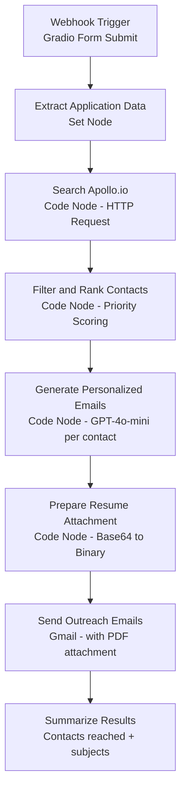

# 🎯 Job Application Outreach Agent

> 🔗 **[Live n8n Workflow](https://aravind5.app.n8n.cloud/workflow/sYlzBFqoLBAfGfVE)**

An n8n-powered personal job search agent that takes a job description, searches Apollo.io for hiring managers and team leads at the target company, generates a personalized GPT-4o-mini outreach email for each contact, and sends them via Gmail with your resume attached — all in one click.

## What It Does

Paste a job description and the agent automatically:

1. **Parses the company domain** from the form and queries Apollo.io's 275M+ contact database
2. **Finds the top 5 contacts** — prioritising Hiring Managers, Recruiters, VP/Head of Engineering, Engineering Managers, and Tech Leads
3. **Filters for verified emails only** — no bounces, only deliverable addresses
4. **Generates a unique personalized email** for each contact using GPT-4o-mini, referencing their specific role and the job applied for
5. **Sends via Gmail** with your resume PDF attached and portfolio link in the signature
6. **Returns a summary** of every contact reached and email subject line sent

## n8n Workflow Architecture



## Setup Instructions

### 1. Clone or fork this Space

```bash
git clone https://huggingface.co/spaces/Darkweb007/job-outreach-agent
cd job-outreach-agent
```

### 2. Install dependencies

```bash
pip install -r requirements.txt
```

### 3. Configure Secrets

In your Hugging Face Space settings, add the following secrets:

| Secret Name | Description | Required |
|---|---|---|
| `OPENAI_API_KEY` | OpenAI API key for GPT-4o-mini email generation | Yes |
| `APOLLO_API_KEY` | Apollo.io API key for contact search | Yes |

Navigate to: **Space Settings → Variables and Secrets → New Secret**

### 4. Run locally

```bash
python app.py
```

### 5. Deploy to HF Spaces

Push to your Space repository — it will build and deploy automatically.

## n8n Integration

To connect this UI to the live n8n workflow:

1. Open the live n8n workflow linked above
2. Copy the webhook URL from the trigger node: `https://aravind5.app.n8n.cloud/webhook/job-outreach`
3. Confirm Gmail OAuth2 credentials are connected in the Send Outreach Email node
4. Activate the workflow
5. The Gradio UI posts directly to this webhook on form submit

## Supported Integrations

| System | Action |
|---|---|
| Apollo.io API | Contact search by company domain — hiring managers, recruiters, engineering leads |
| OpenAI GPT-4o-mini | Personalized email generation per contact (150-200 words each) |
| Gmail | Email delivery with resume PDF attachment and portfolio signature |

## Contact Priority Scoring

| Priority | Title Match | Score |
|---|---|---|
| 🥇 Highest | Hiring Manager | 10 |
| 🥈 | Recruiter / Talent Acquisition | 9 |
| 🥉 | VP Engineering / Head of Engineering | 8 |
| 4 | Director of Engineering | 7 |
| 5 | Engineering Manager | 7 |
| 6 | Technical Lead / Tech Lead | 5 |
| 7 | Other titles | 2 |

## Getting Your Apollo API Key

1. Sign up free at [apollo.io](https://apollo.io)
2. Go to Settings → Integrations → API
3. Copy your API key
4. Free tier: 50 verified email credits per month — enough for active job searching

## License

MIT
